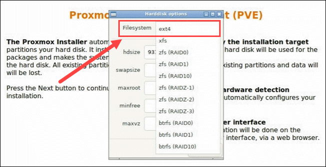
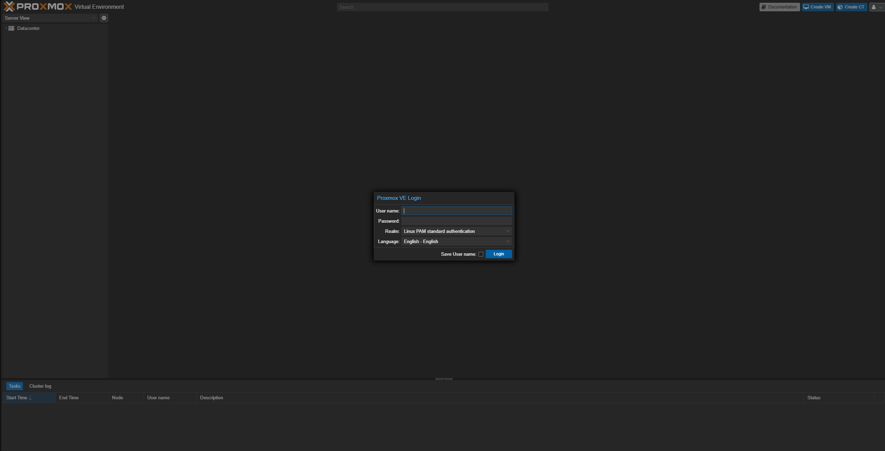
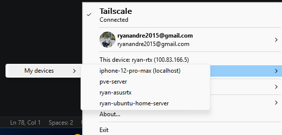

# NextCloud 1TB Home Storage

Favorite: No
Archive: No
Notebook: Home Server
Edited: June 18, 2026 11:28 PM
Created: June 5, 2026 10:52 AM

## Creating Proxmox Server as Bare-Metal Hypervisor

#### Hardware Specs:

- CPU: Ryzen 3 3100 (4 cores, 8 threads)
- RAM: 16GB DDR4 3600Mhz
- HDD: 1TB
- SSD: 500G

#### Downloading and installing the Proxmox Server

1. Create bootable USB drive using RUFUS and attach Proxmox ISO to it from https://www.proxmox.com/en/downloads.
2. In the BIOS settings of the computer, enable CPU Virtualization and Disable ERP from power settings.
3. Plug in the boot USB Drive and press F11 (depends on manufacturer of your BIOS) to enter the boot configuration.
4. Boot into the USB partition (this option will depend whether your BIOS is configured for UEFI or CSM).
5. Once booted into the USB drive, the Proxmox installer will appear.
6. I choose to install the Proxmox (Terminal UI).
7. Note: If your PC has a graphical driver, chances are you may encounter “FATAL: module shpchp not found”, which means theres conflict with the GPU drivers and installer.
   1. The resolution to this is to select an installation method, and press “e”. This will open up a command script that you should edit. Add “nomodeset” to the end of the /boot /linux line and CTRL+X to save changes.

#### Configuring the Proxmox Server (via installer GUI)

1. It will prompt you for the target harddisk, ensure that you select the SSD for optimal performance of the server and ext4 as the fs for this server. _Selecting the HDD will cause slower performance._



1. Admin password and email. Set this as you like but ensure to put in an actual email ID and not a fake one.


1. mgmt interface is nic0 for me which is the ethernet, this ensures that after installation, I have instant access to internet so I can setup the server properly. If you have a wireless NIC, this won’t work out of the box and would need internet connection to setup the dependencies.
   - management interface → nic0: ethernet
   - hostname → pve-server.home (this can be anything you like)
   - IP address → (redacted for privacy) set this as IP from your network where the server is!
   - Gateway → (redacted) the router IP
   - DNS Server → (redacted) same as the gateway


1. The system will now install and then boot in the ProxmoxVE server
2. I encountered a boot loop issue here and you can solve this by pressing any button to cancel the boot loop and then it will prompt you options, click on “continue to boot”, so it automatically boots to the CLI always.
3. The proxmox server can now be accessed using the IP of the machine



## Proxmox VPN Remote Access Setup

1. SSH into the Proxmox Host using

```bash
ssh root@<thelocalIP>
```

2. Run the Tailscale installation script once you've gained access to the Server machine

```bash
curl -fsSL https://tailscale.com/install.sh | sh
```

3. Spin up the daemon and it will generate the authentication link to pair machines into the VPN network

```bash
tailscale up
```

4. Click on the link to pair machine into the VPN network, it will prompt you for credentials

5. When away from the local network, you can access the Server safely by connecting to the VPN and utilizing the private IP address it provides.



## 1TB HDD Partition Drive Setup

1. Go to the main pve-server node


1. Under Disks > LVM-Thin, click on Create: Thinpool. It will says no disks unused for me because I have already attached the HDD previously, but if you haven’t, you will see your HDD and its storage space available.
   1. The HDD storage will now be successfully initialized as a storage space as seen in the screenshot.


## Attaching Formatted 1TB HDD to VM

1. In the Ubuntu node, under hardware tab, select add.


1. Add hard disk, select the storage (for me it is hdd-storage-thin).


1. Under Disk Size (GiB), specify desired storage space, select discard and IO thread to optimize data flow to physical HDD.


1. Start VM, and check lsblk to verify attached HDD (shown in screenshot below)

## Formatting and Mounting the HDD

1. _sudo mkfs.ext4_ is for creating a new ext4 file system.
2. _sudo mkdir -p /mnt/nextcloud-data_ is to create the mount target for the HDD.
3. _echo ‘dev/sdb /mnt/nextcloud-data ext4 defaults 0 2’ | sudo tee -a /etc/fstab_ is to append the the HDD to the system configuration table. So every time the VM spins up, the HDD is mounted automatically.
4. _sudo systemctl daemon-reload_ is for reloading system daemon, this is must as fstab has been modified but without reloading the system still uses the old configuration.
5. sudo mount -a to mount the HDD and df -h | grep nextcloud-data to confirm that the HDD has been attached successfully.

```bash
user:~$ lsblk
NAME   MAJ:MIN RM   SIZE RO TYPE MOUNTPOINTS
loop0    7:0    0     4K  1 loop /snap/bare/5
loop1    7:1    0  19.6M  1 loop /snap/desktop-security-center/150
loop2    7:2    0  66.8M  1 loop /snap/core24/1643
loop3    7:3    0  66.8M  1 loop /snap/core24/1587
loop4    7:4    0    20M  1 loop /snap/desktop-security-center/151
loop5    7:5    0 273.7M  1 loop /snap/firefox/8107
loop6    7:6    0 606.1M  1 loop /snap/gnome-46-2404/153
loop7    7:7    0  16.5M  1 loop /snap/firmware-updater/226
loop8    7:8    0  91.7M  1 loop /snap/gtk-common-themes/1535
loop9    7:9    0  18.8M  1 loop /snap/prompting-client/222
loop10   7:10   0   395M  1 loop /snap/mesa-2404/1165
loop11   7:11   0  49.3M  1 loop /snap/snapd/26865
loop12   7:12   0   580K  1 loop /snap/snapd-desktop-integration/361
loop13   7:13   0  18.8M  1 loop /snap/prompting-client/204
loop14   7:14   0  15.7M  1 loop /snap/snap-store/1367
sda      8:0    0    32G  0 disk
├─sda1   8:1    0     1M  0 part
└─sda2   8:2    0    32G  0 part /
sdb      8:16   0   500G  0 disk
sr0     11:0    1   6.1G  0 rom  /run/media/ryan/Ubuntu 26.04 amd64
user:~$
user:~$
user:~$ sudo mkfs.ext4 /dev/sdb
[sudo: authenticate] Password:
mke2fs 1.47.2 (1-Jan-2025)
Discarding device blocks: done
Creating filesystem with 131072000 4k blocks and 32768000 inodes
Filesystem UUID: e1b2dee7-d3fe-4bcf-93ef-b38190871d55
Superblock backups stored on blocks:
	32768, 98304, 163840, 229376, 294912, 819200, 884736, 1605632, 2654208,
	4096000, 7962624, 11239424, 20480000, 23887872, 71663616, 78675968,
	102400000

Allocating group tables: done
Writing inode tables: done
Creating journal (262144 blocks): done
Writing superblocks and filesystem accounting information: done

user:~$ sudo mkdir -p /mnt/nextcloud-data
user:~$ echo '/dev/sdb /mnt/nextcloud-data ext4 defaults 0 2' | sudo tee -a /etc/fstab
/dev/sdb /mnt/nextcloud-data ext4 defaults 0 2
user:~$ sudo mount -a
mount: (hint) your fstab has been modified, but systemd still uses
       the old version; use 'systemctl daemon-reload' to reload.
user:~$ sudo systemctl daemon-reload
user:~$ sudo mount -a
user:~$ df -h | grep nextcloud-data
/dev/sdb        492G  2.1M  467G   1% /mnt/nextcloud-data //I will be upgrading this to 1TB if storage demands scale up!
```

## Nextcloud Docker Compose Setup

1. Make the directory and go inside

```bash
mkdir ~/nextcloud-server && cd ~/nextcloud-server
```

1. Compose the configuration file

```bash
nano docker-compose.yml
```

1. The config file

```bash
version: '3.8'

services:
  db:
    image: postgres:15-alpine
    container_name: nextcloud-db
    restart: always
    volumes:
      - nextcloud_db_data:/var/lib/postgresql/data
    environment:
      - POSTGRES_DB=dbname
      - POSTGRES_USER=someadmin
      - POSTGRES_PASSWORD=somepasswordhere
    networks:
      - nextcloud_net

  app:
    image: nextcloud:latest
    container_name: nextcloud-app
    restart: always
    ports:
      - 11010:80
    volumes:
      - /mnt/nextcloud-data:/var/www/html/data
      - nextcloud_config:/var/www/html/config
      - nextcloud_apps:/var/www/html/custom_apps
    environment:
      - POSTGRES_HOST=db
      - POSTGRES_DB=somename
      - POSTGRES_USER=someadmin
      - POSTGRES_PASSWORD=somepasswordhere
      - NEXTCLOUD_TRUSTED_DOMAINS=your trusted domains here
    depends_on:
      - db
    networks:
      - nextcloud_net

volumes:
  nextcloud_db_data:
  nextcloud_config:
  nextcloud_apps:

networks:
  nextcloud_net:
    driver: bridge


// UPDATED CONFIG FOR HTTPS AND DYNAMIC IP WITH TAILSCALE
version: '3.8'

services:
  db:
    image: postgres:15-alpine
    container_name: nextcloud-db
    restart: always
    volumes:
      - nextcloud_db_data:/var/lib/postgresql/data
    environment:
      - POSTGRES_DB=somename
      - POSTGRES_USER=someadmin
      - POSTGRES_PASSWORD=somepasswordhere
    networks:
      - nextcloud_net

  app:
    image: nextcloud:latest
    container_name: nextcloud-app
    restart: always
    ports:
      - <redacted>
    volumes:
      - /mnt/nextcloud-data:/var/www/html/data
      - nextcloud_config:/var/www/html/config
      - nextcloud_apps:/var/www/html/custom_apps
    environment:
      - POSTGRES_HOST=somename
      - POSTGRES_DB=somename
      - POSTGRES_USER=someadmin
      - POSTGRES_PASSWORD=somepasswordhere
      - NEXTCLOUD_TRUSTED_DOMAINS=your trusted domains here ex. xxx.xxx.x.xxx
      - PHP_UPLOAD_LIMIT=0
      - PHP_MEMORY_LIMIT=2G
      - NEXTCLOUD_MAX_CHUNK_SIZE=209715200
      - OVERWRITEHOST=dns from tailscale ex. ubuntu-vm.tailscale.dns.ts.net
      - OVERWRITEPROTOCOL=https
      - OVERWRITECONDADDR=^100\.\d+\.\d+\.\d+$ //dynamic proxy for local network and VPN access
      - TRUSTED_PROXIES=127.0.0.1
    depends_on:
      - db
    networks:
      - nextcloud_net

volumes:
  nextcloud_db_data:
  nextcloud_config:
  nextcloud_apps:

networks:
  nextcloud_net:
    driver: bridge

```

1. Launch the stack

```bash
sudo docker compose up -d
sudo docker ps //to verify it's running
```

1. Now I can access Nextcloud Web UI from my Tailscale DNS or if at home the IP of the server with port 11010 (this is with already set up account).


