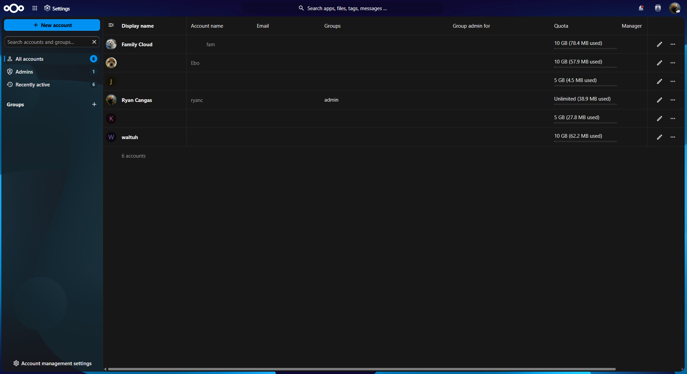

# 🌐 Enterprise-Grade 1TB Self-Hosted Home Cloud Storage Architecture
### *A Bare-Metal Virtualized Private Cloud Storage Infrastructure Deployment*

## 📖 [View My Detailed Implementation Notes Diary] (NextCloud%201TB%20Home%20Storage.md)

---

## 🎯 Project Overview 

This repository showcases the architectural design, implementation, and deployment of a highly resilient, production-grade self-hosted cloud storage ecosystem. Built on top of a bare-metal type-1 hypervisor, this system decouples compute resources from physical storage tiers to deliver low-latency, fully unthrottled local file synchronization for multi-user household environments while securing remote endpoints via an encrypted software-defined mesh network.

### 💼 What's the point of this project?
As a student, multiple subscriptions on Cloud solutions like storage are extremely costly, especially when always backing up important files that are as large as 500GB to 1TB! 

As a developing Junior Cloud Engineer, I decided to transform an old gaming PC that's been collecting dust to a Proxmox Server, despite it being weak in today's compute offering standards, it had ample power to power up a few lightweight Virtual Machines that can be used for technical projects, and especially this Cloud Storage solution that uses Ubuntu 26.04 LTS.

Now I have a Cloud Storage solution for my family that's completely free, self-provisioned and maintained by me! I can provision how much storage everyone in the family can have, take snapshots of their backups and snapshots of the Virtual Machine to ensure high-availability and stress-free usage locally and remotely.

---

## 🏗️ High-Level Infrastructure Topology

┌─────────────────────────────────────────────────────────────────┐
│                    PROXMOX VE (Type-1 Hypervisor)               │
│                                                                 │
│  ┌───────────────────────────────────────────────────────────┐  │
│  │                UBUNTU SERVER VIRTUAL MACHINE              │  │
│  │                                                           │  │
│  │   ┌─────────────────────────┐   ┌─────────────────────┐   │  │
│  │   │     Nextcloud Core      │   │    PostgreSQL 15    │   │  │
│  │   │   (Application Tier)    │───│  (Data Storage Tier)│   │  │
│  │   └────────────┬────────────┘   └─────────────────────┘   │  │
│  │                │                                          │  │
│  │                ▼ (EXT4 High-Performance Mount)            │  │
│  │       📂 Absolute Path: /mnt/nextcloud-data               │  │
│  └────────────────▲──────────────────────────────────────────┘  │
│                   │                                             │
│                   │ (Hardware LVM-Thin Storage Pass-through)    │
│  ┌────────────────┴──────────────────────────────────────────┐  │
│  │       💾 1TB Physical SATA Hardware Storage Array         │  │
│  └───────────────────────────────────────────────────────────┘  │
└─────────────────────────────────────────────────────────────────┘

---

## 🛠️ Technical Skills 

This project utilizes multiple Network, Cloud and Engineering Fundamentals such as:

### 🎛️ 1. Hypervisor Engineering & Virtualization
* **Type-1 Bare-Metal Proxmox Implementation:** Configured hypervisor partitions, optimized virtualization flags, and modified active kernel schemas.
* **Kernel Parameter Tuning:** Troubleshot advanced display driver collisions during installer initialization by intercepting the boot script and appending standard `nomodeset` hardware validation locks.

### 🗄️ 2. Storage Subsystem & Linux Systems Engineering
* **Storage Tiers Decoupling:** Separated ephemeral operating systems (installed onto low-latency 500GB SSD configurations) from persistent blocks.
* **LVM-Thin Provisioning:** Allocated logical storage volumes dynamically to prevent capacity stranding and improve disk utilization efficiency.
* **Block Device Administration:** Formatted raw virtual device nodes with a robust journaled `EXT4` system file system, configured automated directory structures, and engineered immutable mount parameters inside `/etc/fstab` to ensure runtime persistence across reboot cycles.
* **I/O Optimization Queues:** Enabled `discard` and `io-threads` flags at the hypervisor configuration layer to eliminate physical host execution write-amplification locks.

### 🐳 3. DevSecOps & Container Orchestration
* **Microservices Architecture:** Engineered automated decoupled blueprints mapping transactional applications seamlessly away from operational backend systems.
* **Container Lifecycles:** Configured structured networking protocols utilizing Docker bridge environments to cleanly contain backend data communication pathways from open interfaces.
* **Environment Fine-Tuning:** Tweaked embedded variables (`PHP_MEMORY_LIMIT=2G`, large chunk sizing optimizations) to streamline large file ingestion without data exhaustion faults.

### 🌐 4. Network Engineering & Cryptographic Mesh Topologies
* **Software-Defined VPN Topologies:** Created dedicated, end-to-end encrypted tunnels using WireGuard infrastructure protocols over Tailscale mesh systems.
* **Ingress Management Routing:** Optimized local network bandwidth allocation, allowing zero-overhead high-speed transfers natively while maintaining cryptographic validations.

---

## 💡 Architecture & Engineering Choices

A core skill demonstrated throughout this lifecycle was navigating the real-world operational challenges of deployment within consumer-grade network landscapes. 

An iteration of this project contained Nginx Reverse Proxy Manager with a local AdGuard Home DNS server, to support local domain mapping and enforce SSL/TLS termination, but due to hardware limitations (router does not allow DNS configuration changes) that prevents modification of DNS server assignments, which means I had to manually change the preferred DNS of every machine in the household manually, which is redundant and is poor architecture choice.

Since the vendor has locked DNS changes within the router, I decided to entirely dismiss AdGuard and Nginx and mapped Nextcloud directly to the server's local IP on a high port, providing family members at home immediate connection, configuration-free and high-throughput transfer speeds without requiring an active VPN connection.

---